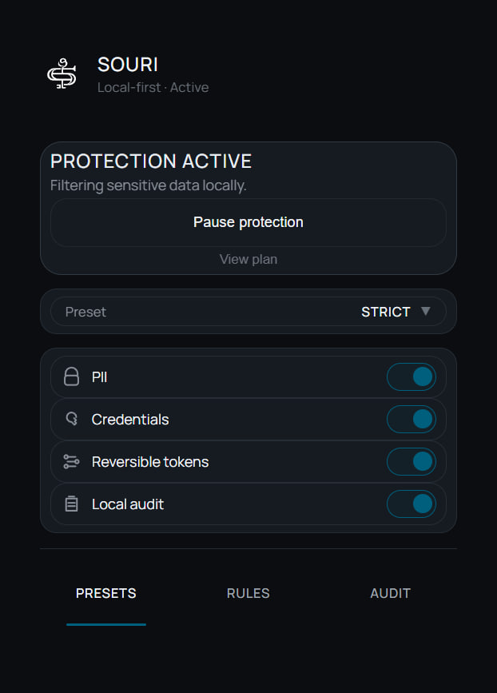
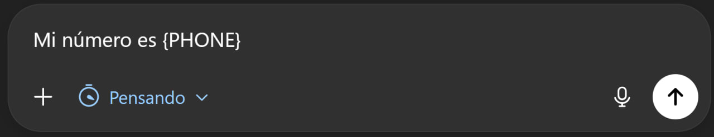
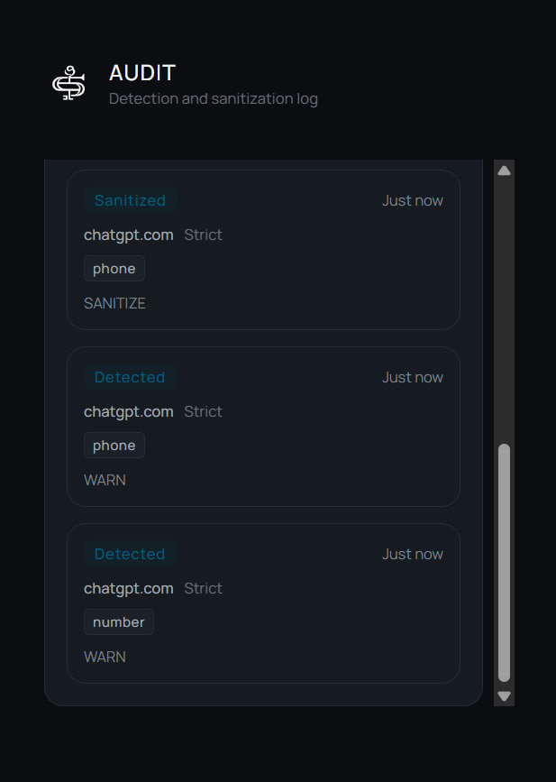
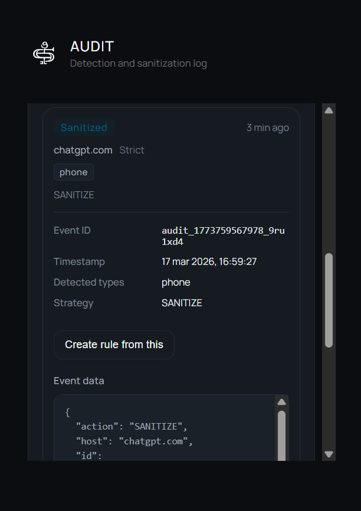
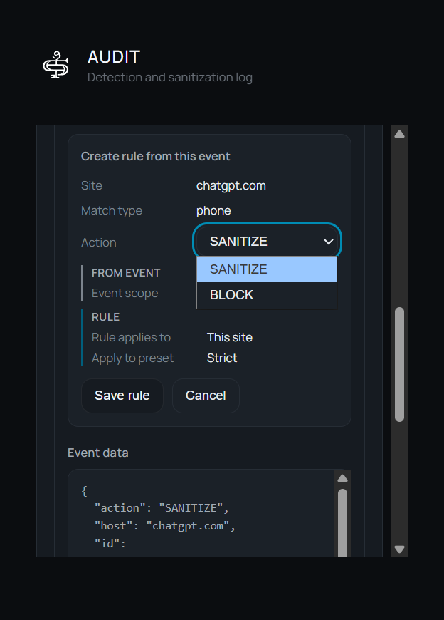
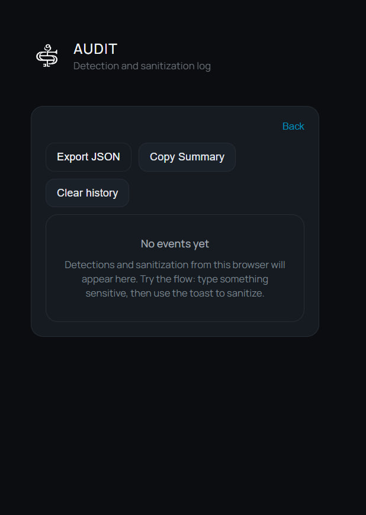
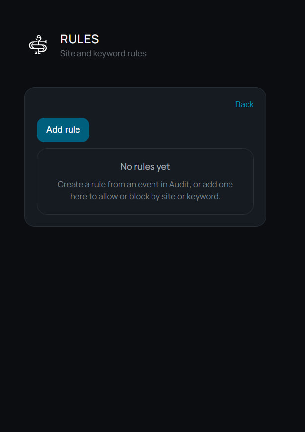
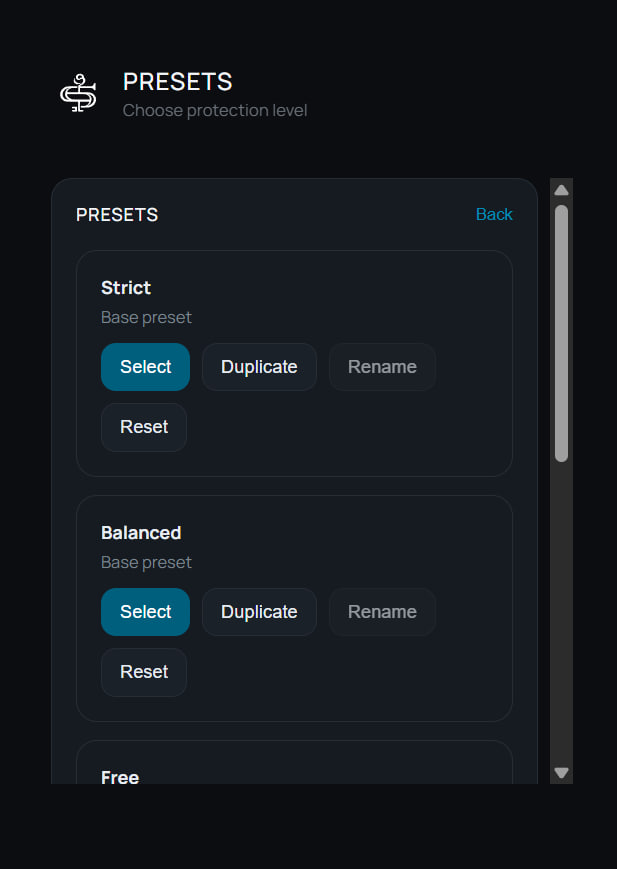

# SOURI

**Protect sensitive data before it reaches AI.**

SOURI is a privacy-first, local-first browser extension designed to help users detect, sanitize, and audit sensitive information before it is submitted to AI tools.

Built for practical AI workflows, SOURI adds visible controls, real-time sanitization, and reusable privacy rules so users stay in control of what they send.

**Website:** [souri-site.vercel.app](https://souri-site.vercel.app)

---

## The problem

People regularly paste emails, phone numbers, identifiers, credentials, and other sensitive information into AI systems. In most workflows, there is little visibility or control before that information is submitted.

SOURI is being built to reduce that exposure at the input level — before sensitive data leaves the screen.

---

## What SOURI does

- Detects sensitive data in active inputs
- Supports prompt sanitization before submission
- Provides visible in-context actions through a toast UI
- Keeps an audit trail of relevant privacy events
- Turns repeated actions into reusable privacy rules

---

## Core principles

- **Privacy-first**
- **Local-first**
- **User control**
- **Visible feedback**
- **Reusable workflows**

---

## Current status

SOURI is in active development.

The current public repository focuses on product direction, documentation, screenshots, and public-facing materials, while the core implementation remains private during the early product phase.

The public landing page is available at [souri-site.vercel.app](https://souri-site.vercel.app).

---

## Documentation

- [Architecture](docs/architecture.md)
- [Privacy](docs/privacy.md)
- [Roadmap](docs/roadmap.md)

---

## Research background

SOURI is also informed by academic work exploring privacy risks in AI-assisted workflows and methods for protecting sensitive data before submission.

A Russian-language research paper describing part of the conceptual foundation of the project is available here:

- [SOURI research paper](research/souri-research-paper-ru.pdf)

---

## Product preview

### Home

### Detection toast

### Sanitized input

### Audit history

### Audit event expanded

### Create rule from audit

### Rules with created rule

### Audit empty state

### Rules empty state

### Presets library

---

## Why it matters

SOURI is designed as a practical privacy layer for AI workflows:

- detect sensitive information early
- sanitize before submission
- provide visible auditability
- turn privacy actions into reusable rules over time

The goal is not only to warn users, but to make privacy protection operational, visible, and repeatable inside real AI usage.

---

## Public presence

SOURI currently has two public surfaces:

- This repository, which contains the public product README, documentation, and screenshots
- The public landing page: [souri-site.vercel.app](https://souri-site.vercel.app)

---

## Notes

This repository represents the public-facing product presence of SOURI.

More public materials will be added as the product presentation layer evolves.
