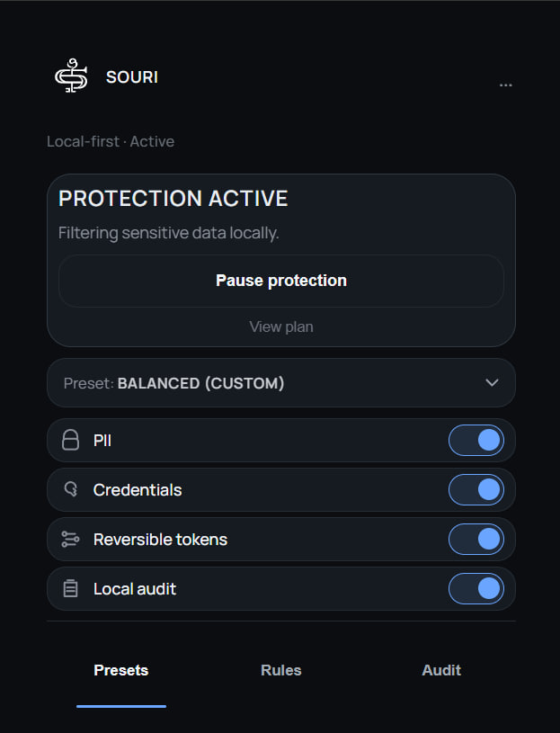
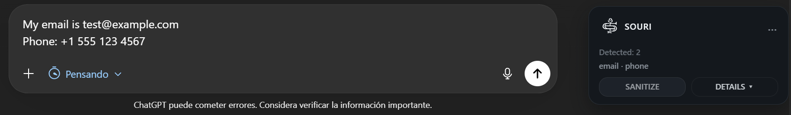
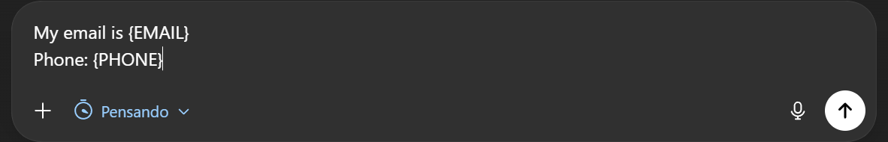
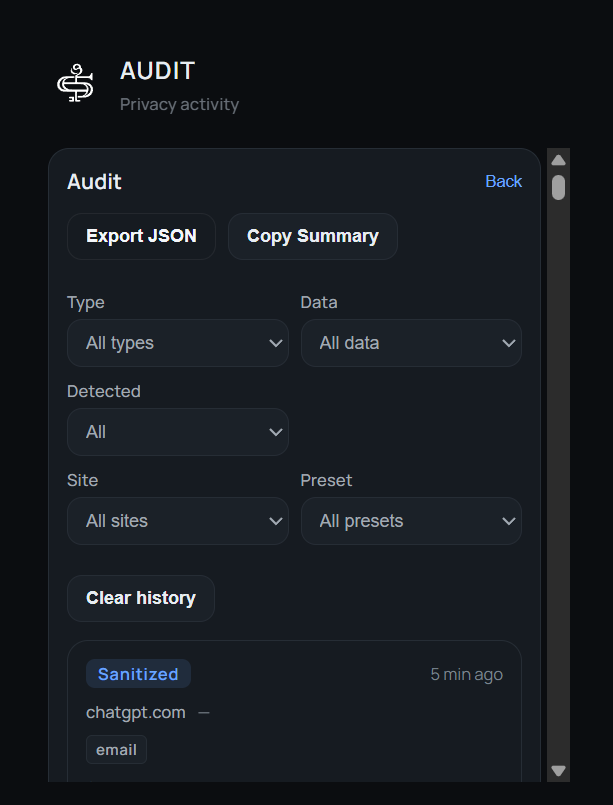
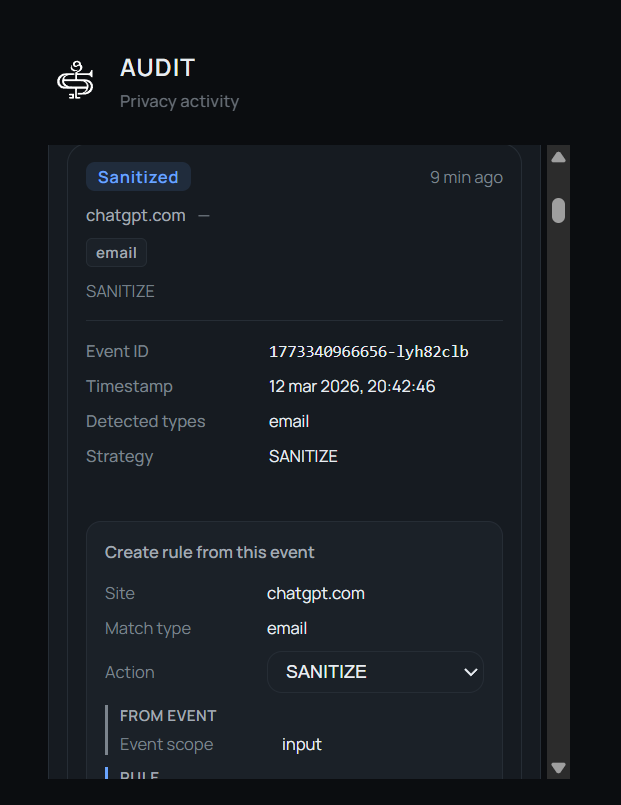
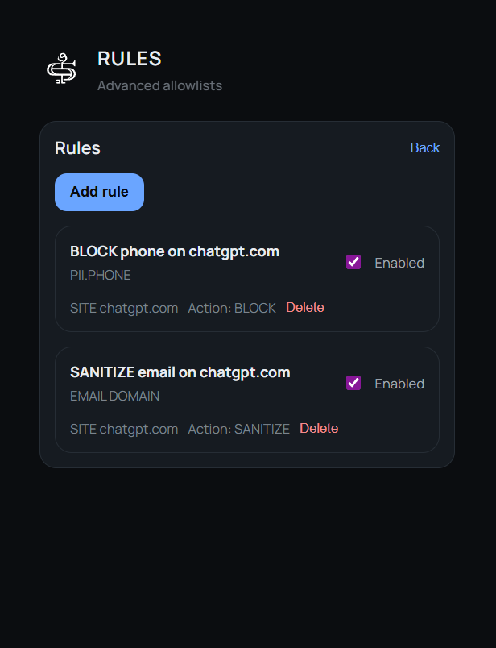

# SOURI

**Protect sensitive data before it reaches AI.**

SOURI is a privacy-first, local-first browser extension that helps users detect, sanitize, and audit sensitive information in prompts before submission.

Built for practical AI workflows, SOURI adds visible controls, real-time sanitization, and reusable privacy rules so users stay in control of what they send.

**Website:** [souri-site.vercel.app](https://souri-site.vercel.app)

---

## The problem

People regularly paste emails, phone numbers, identifiers, credentials, and other sensitive information into AI tools. In most workflows, there is little visibility or control before that information is submitted.

SOURI is being built to reduce that exposure at the input level — before sensitive content leaves the screen.

---

## What SOURI does

- Detects sensitive data in active inputs
- Supports prompt sanitization before submission
- Provides visible in-context actions through a toast UI
- Keeps an audit trail of relevant privacy events
- Turns real events into reusable privacy rules

---

## Core principles

- **Privacy-first**
- **Local-first**
- **User control**
- **Visible feedback**
- **Reusable workflows**

---

## Current status

SOURI is in active development.

The current public repository focuses on product direction, documentation, screenshots, and public-facing materials while the core implementation remains private during the early product phase.

The public landing page is now available at [souri-site.vercel.app](https://souri-site.vercel.app).

---

## Documentation

- [Architecture](docs/architecture.md)
- [Privacy](docs/privacy.md)
- [Roadmap](docs/roadmap.md)

---

## Research background

SOURI is also informed by academic work exploring privacy risks when interacting with AI systems and approaches for protecting sensitive data before submission.

A Russian-language research paper describing the conceptual foundation of the project is available here:

- [SOURI research paper](research/souri-research-paper-ru.pdf)

---

## Screenshots

### Popup overview

### Detection in context

### Sanitization result

### Audit viewer

### Create rule from event

### Rules list

---

## Project direction

SOURI is designed as a practical privacy layer for AI workflows:

- detect sensitive information early
- allow users to sanitize before sending
- provide visible auditability
- make privacy actions reusable over time

---

## Public presence

SOURI currently has two public surfaces:

- This repository, which contains the public product README, documentation, and screenshots
- The public landing page: [souri-site.vercel.app](https://souri-site.vercel.app)

---

## Notes

This repository currently represents the public product presence of SOURI.

More public materials will be added as the product presentation layer evolves.
